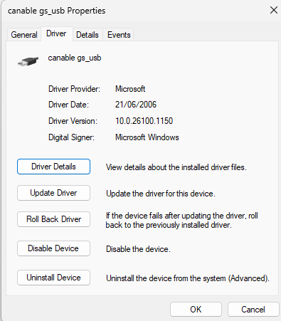
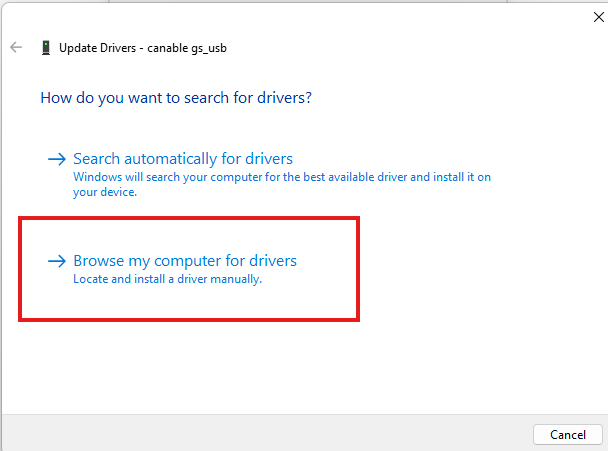
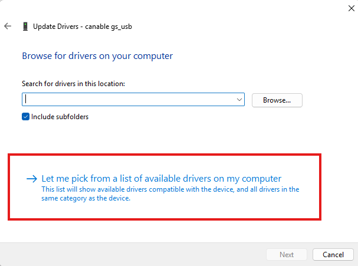
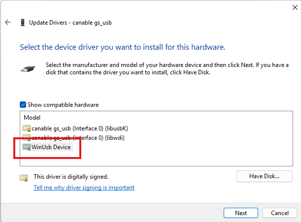
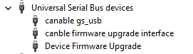

# SavvyCAN + CANable Setup — Screenshots

Step-by-step screenshots for setting up the CANable clone with SavvyCAN on Windows.

## Steps covered

1. **CANable in DFU mode** — Device Manager showing the board before flashing,
   so you can confirm it's been detected correctly.
2. **WinUSB driver selection** — the correct driver selection after flashing
   CandleLight firmware.
     
   
   
   
   
3. **CANable ready in Device Manager** — what a correctly configured board looks
   like after the WinUSB driver is applied.  
   

4. **SavvyCAN connection settings** — the Add New Device Connection dialog with
   `qtcandlelightcanbus.dll` selected and 500000 baud (HS CAN).
   *Screenshots to be added*
